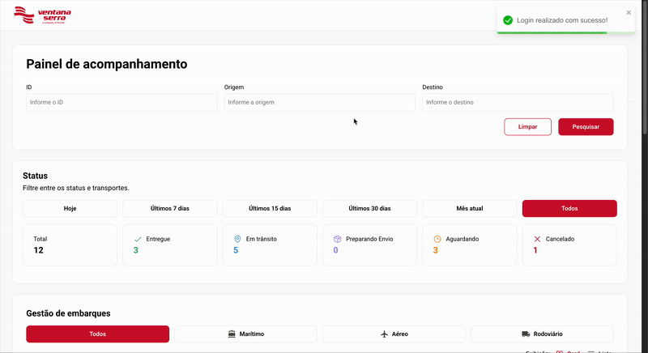
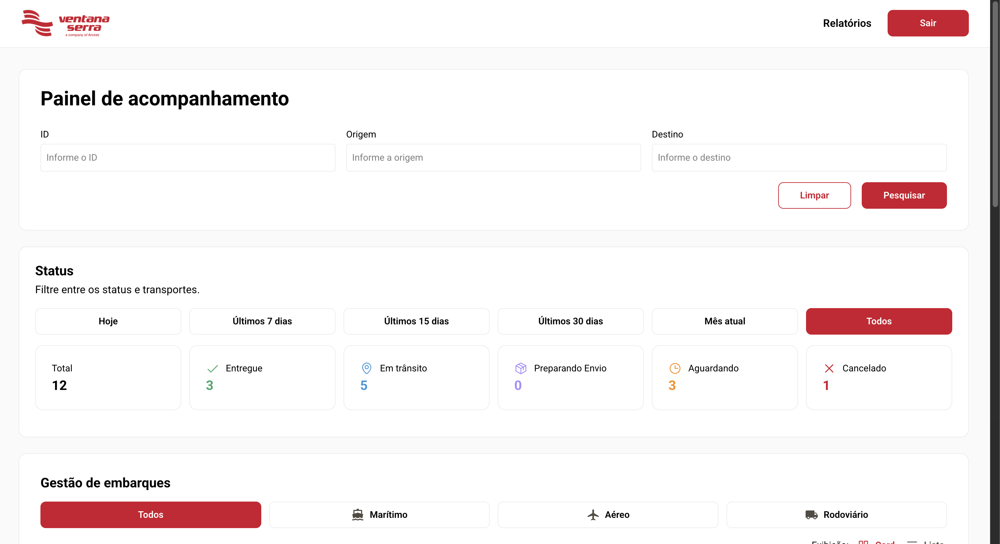
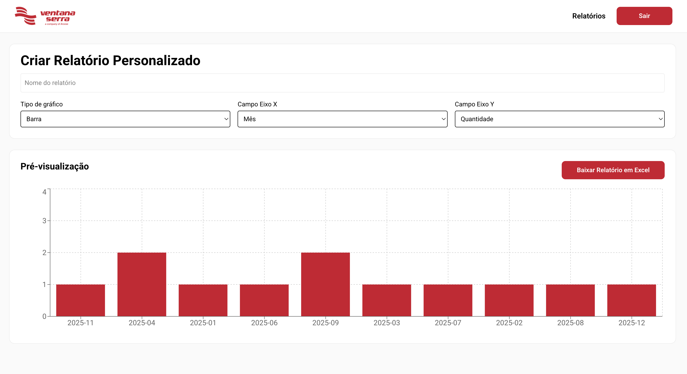
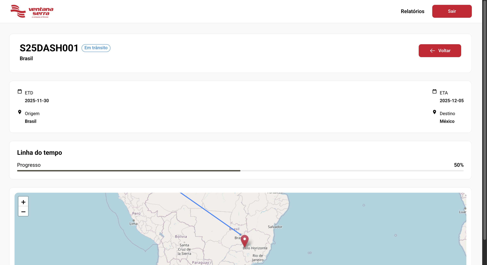

# Portal do Cliente 🚀

[](https://reactjs.org/)
[](https://www.typescriptlang.org/)
[](https://vitejs.dev/)
[](https://tailwindcss.com/)
[](#)

---

## Descrição

O **Portal do Cliente** é uma aplicação web moderna que fornece uma interface interativa para clientes.

Principais recursos:

- Mapas interativos com **Leaflet**
- Gráficos dinâmicos com **Recharts**
- Notificações com **React Toastify**
- Navegação SPA com **React Router DOM**
- Tipagem segura com **TypeScript**
- Testes unitários e cobertura com **Vitest**

---

## Demonstração



---

## Screenshots

| Tela Inicial | Gráfico de Dados | Mapa Interativo |
|--------------|----------------|----------------|
|  |  |  |

---

## Tecnologias Utilizadas

- **React 19**  
- **TypeScript 5.9**  
- **Vite 7**  
- **TailwindCSS 4**  
- **Leaflet & React-Leaflet**  
- **Recharts**  
- **React Router DOM**  
- **React Toastify**  
- **Vitest & React Testing Library**  
- **ESLint**

---

## Pré-requisitos

- Node.js >= 20  
- Gerenciador de pacotes (PNPM, npm ou yarn)

---

## Instalação

```bash
git clone <URL_DO_REPOSITORIO>
cd portal-do-cliente
pnpm install
pnpm dev
```

---

## Scripts

| Comando                  | Descrição                                                                 |
|---------------------------|---------------------------------------------------------------------------|
| `pnpm dev`               | Inicia servidor de desenvolvimento do Vite.                               |
| `pnpm build`             | Compila para produção.                                                    |
| `pnpm preview`           | Preview local da build de produção.                                       |
| `pnpm lint`              | Verifica padrões de código com ESLint.                                    |
| `pnpm test`              | Executa testes unitários.                                                 |
| `pnpm test:watch`        | Executa testes em modo watch.                                             |
| `pnpm test:coverage`     | Gera relatório de cobertura de testes.                                    |

---

## Estrutura do Projeto

```
portal-do-cliente/
│
├─ public/                # Arquivos estáticos (imagens, vídeos, GIFs)
├─ src/
│  ├─ assets/             # Recursos estáticos
│  ├─ components/         # Componentes reutilizáveis
│  ├─ context/            # Contextos React
│  ├─ pages/              # Páginas da aplicação
│  ├─ routes/             # Configuração de rotas
│  ├─ styles/             # Estilos/Tailwind
│  └─ main.tsx            # Entry point da aplicação
├─ package.json
├─ tsconfig.json
└─ vite.config.ts
```

---

## Roadmap

- [x] Configuração do projeto com Vite, React e TypeScript  
- [x] Integração com TailwindCSS  
- [x] Criação de componentes reutilizáveis  
- [x] Implementação de mapas interativos com Leaflet  
- [x] Visualização de dados com Recharts  
- [x] Notificações com React Toastify  
- [ ] Testes unitários completos com Vitest  
- [ ] Implementar autenticação e persistência de login  
- [ ] Otimização de performance e build

---

## Testes

Executar testes:

```bash
pnpm test
```

Modo watch:

```bash
pnpm test:watch
```

Cobertura:

```bash
pnpm test:coverage
```

---

## Contribuição

1. Faça um fork do repositório  
2. Crie uma branch: `git checkout -b minha-feature`  
3. Faça commit das alterações: `git commit -m "Minha feature"`  
4. Envie para o branch remoto: `git push origin minha-feature`  
5. Abra um Pull Request

---

## Licença

Este projeto é **privado**.